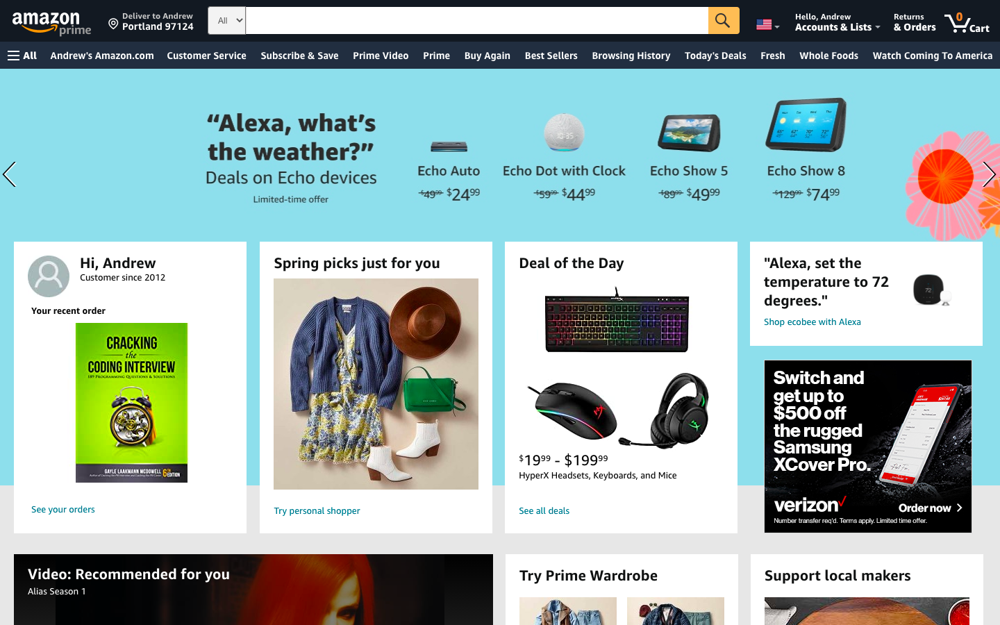
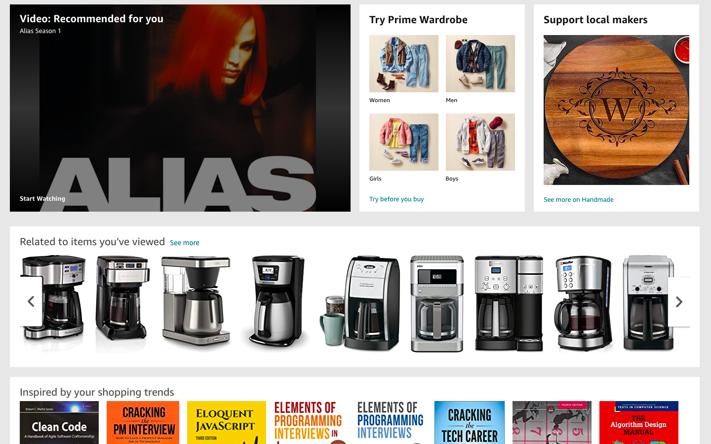
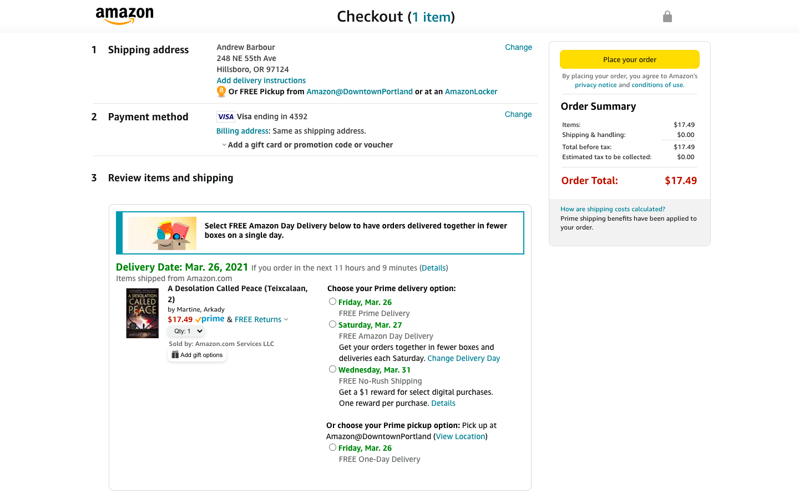

# Amazon

A high fidelity, responsively designed Amazon clone site

## Table of Contents
* [Description](#description)
* [Screenshots](#screenshots)
* [Technologies](#technologies)
* [Setup](#setup)
* [Features](#features)
* [Status](#status)

## Description

I built a responsively designed, high fidelity Amazon clone site with JS/React. The app replicates much of Amazon’s core functionality including the front page, search results, product pages, and the main checkout flow. All of the components are fully interactive and responsively designed, from modals and popup menus to carousels and forms. The site also dynamically calculates the shipping date of items based on the delivery option selected. 

For the moment, the site is loaded with sample content because Amazon’s API is private. But you can simulate a full site interaction by searching for “Cracking the Coding Interview” on the main page, clicking on the “System Design Interview” product, adding it to your cart, and proceeding through the checkout flow.

## Screenshots

 

*Front Page*  

 

*Front Page Main Card UI*

 

*Front Page Main Card UI 2*

 

 

*Checkout*

 

## Technologies

* React
* Node.js
* JavaScript

## Setup
Boot up Amazon with `npm start` or `yarn run start`.

## Features

* Replicates most of Amazon's core features, from the landing page to the checkout flow
* Fully functional components on all pages, from carousels to modals to dropdowns